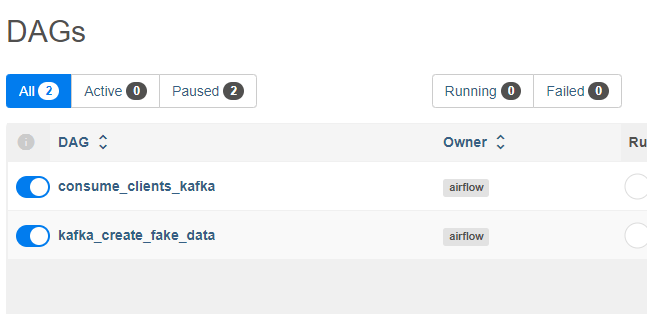
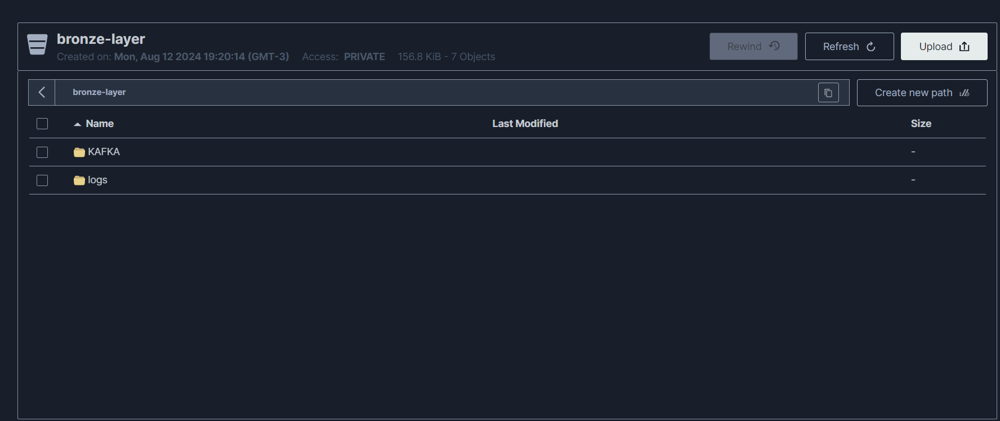
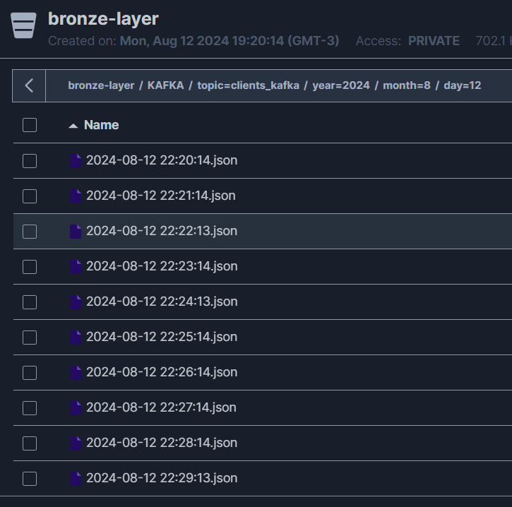
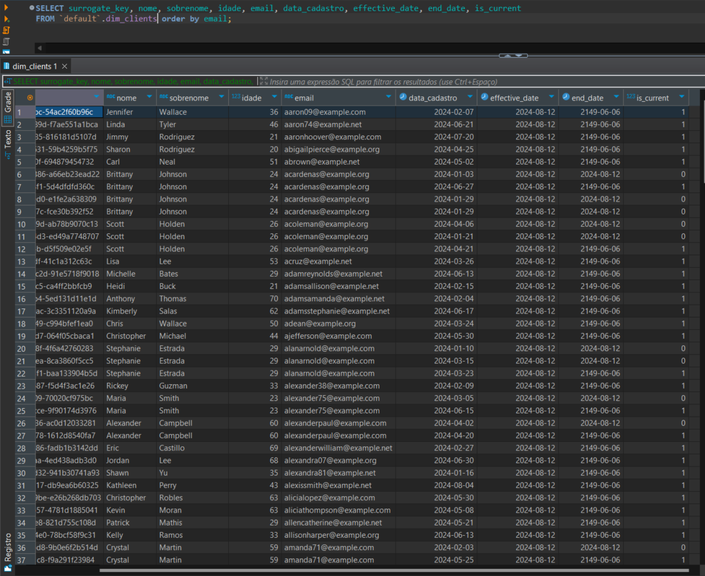

# Instruções
Para iniciar o docker-compose basta executar o comando 
```
docker compose up --build -d
````
Com isso, todas as imagens e dependencias serão baixadas. Após a execução dos containers, aguarde alguns minutos e acesse
o [Airflow no localhost:8080](http://localhost:8080/login/) com **usuário: admin** e **senha: admin**

Após entrar no Airflow, ative a execução das 2 dags:



## DAGs:
- ### **consume_clients_kafka**:
    A fim de exemplo de execução, executa de um em um minuto. Possui duas tasks:
    - **kafka_consume_topic_clients**: responsável por ler as mensagens do tópico kafka e salvar o dado bruto no s3 na camada bronze. Retorna o path do arquivo salvo no s3 para a próxima task. É criado uma tabela no ClickHouse para controle o offset do tópico, simulando uma leitura em batch, para a próxima execução começar fo offset de onde a ultima terminou.

    - **read_file_from_minio**: responsável por ler o arquivo escrito na task anterior e salvar no ClickHouse aplicando SCD2. É utilizado **polars** para manipular os dados (cheguei a testar duckdb também).

- ### **kafka_create_fake_data**:
    A fim de exemplo, executa de um em um minuto. Possui a task:
    - **kafka_create_fake_data**: responsável por gerar dados fakes de clientes e publicar no topico kafka. Utiliza dos dados ja existentes no ClickHouse para gerar dados repetidos com datas de cadastro diferentes a fim de exemplificar o SCD2.

## Visualização dos dados
Para acessar o MiniIO acesse: http://localhost:9001/browser com **usuário: minioadmin e senha: minioadmin**.

Os logs da execução das DAGs são armazenados no bucket bronze_layer via configuração do Conector nas configurações do Airflow no docker-compose.

Os dados brutos são salvos em .json no bucket bronze_layer


o particionamento é feito da seguinte forma:



# ClickHouse

Para viualizar os dados no ClickHouse, eu utilizei o DBeaver no localhost:8123
No SCD2, utilizei o email como chave primaria para aplicar o SCD2 (poderia ser Id, CPF, etc) a fim de comparar novos cadastros com cadastros ja existentes de um cliente.
O SCD2 de um cliente é aplicado com base na data de cadastro, sempre mantendo como **is_current** o cadastro mais atual do cliente.
```sql
CREATE TABLE IF NOT EXISTS dim_clients (
        surrogate_key UUID DEFAULT generateUUIDv4(),
        nome String,
        sobrenome String,
        idade Int32,
        email String,
        data_cadastro Date,
        effective_date Date,
        end_date Date,
        is_current UInt8
    ) ENGINE = MergeTree()
    ORDER BY (nome, sobrenome, effective_date)
    '''
```



# Melhorias:
- Melhorar a passagem de chaves e senhas de acesso.
- Utilizar o pyspark com o Airflow pode ser mais eficiente para manipular os dados e também utilizar Delta Tables como Engine do clickhouse pode ser uma boa opção, fazendo o spark sql apontar para o clickhouse ao criar uma sessão.
- Criar conexão com Kafka via airflow connection.
- Em ambiente produtivo é necessário configurar de forma mais segura as credenciais e acessos.


